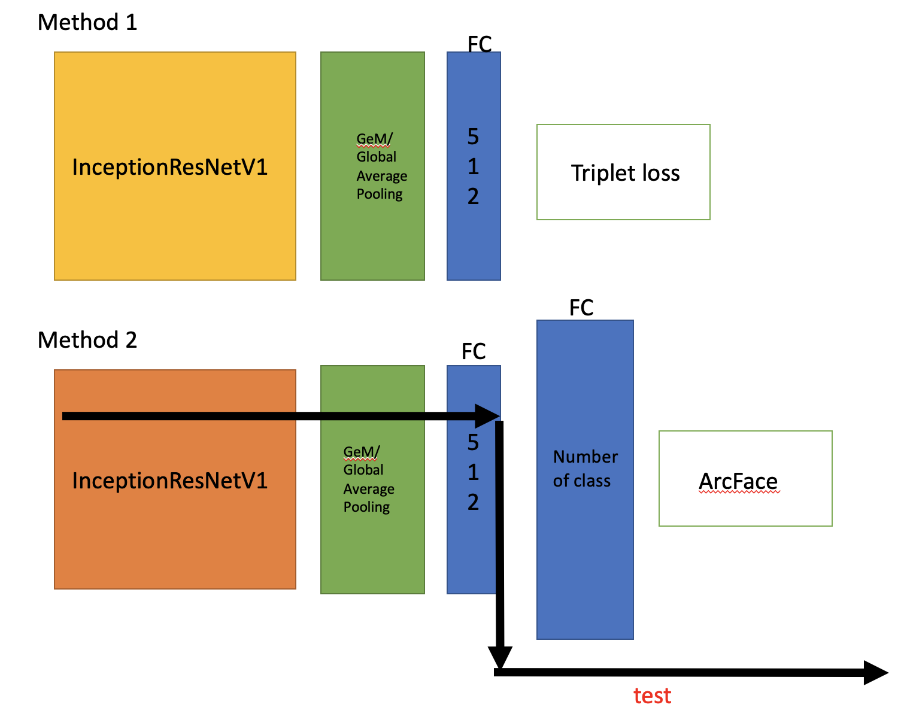
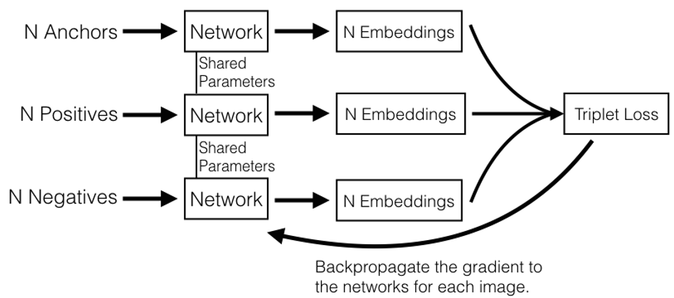
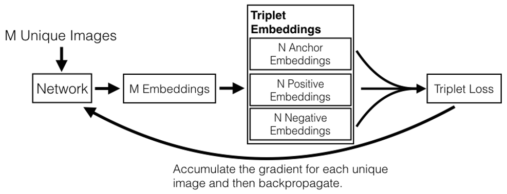
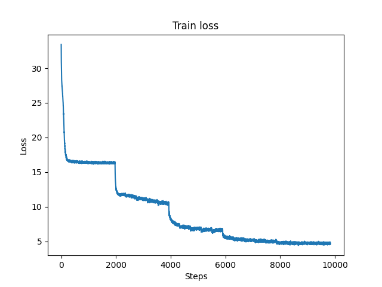
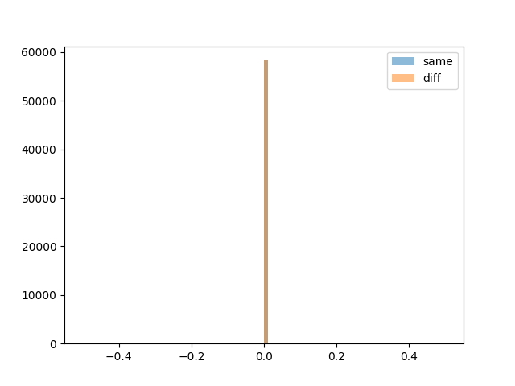
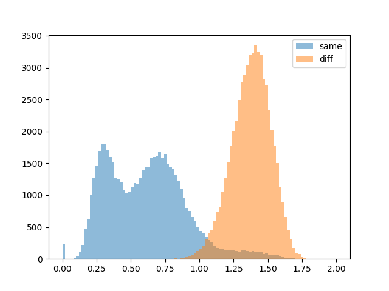
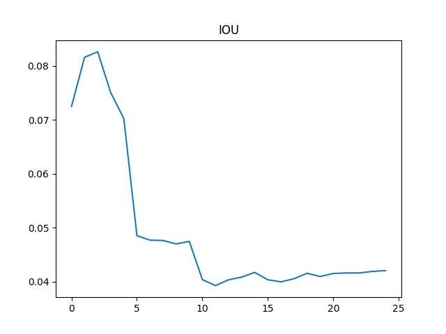
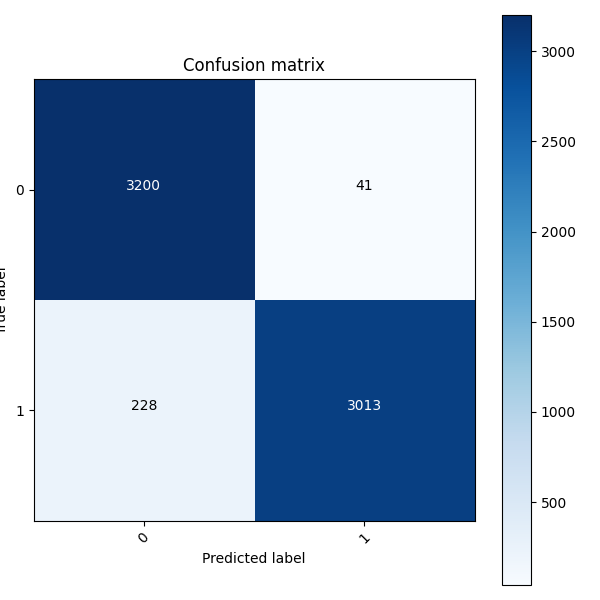

# Masked Facial Recognition
2020/2021 HKUST CSE FYP Masked Facial Recognition, developer: Sam Yuen, Alex Xie, Tony Cheng

Supervisor: Prof. Dit-Yan YEUNG

This Github repository shows how to train a masked face recognition model. We use the masked facial recognition models to build a building security system in another [Github repository](https://github.com/SamYuen101234/BSMFR).

### Download masked facial recognition train and test data

| Dataset     | # Identities|# Images |
| ----------- | ----------- | ----------- |
| CASIA      | 10,585       | 492,832       |
| VGG2   | 8,631        | 2,024,897        |
| LFW (eval+test)   | 5,749        | 64,811        |

- Information of all datasets shown above is after preprocessing so the numbers and sizes differ from the original datasets

1. Training set 1 (Masked CASIA) 3GB
Link: [Google Drive](https://drive.google.com/file/d/1wqLxMbV335dHkX_7lLCROABd6-aC149B/view?usp=sharing)

2. Training set 2 (Masked VGG2) 11GB
Link: [Google Drive](https://drive.google.com/file/d/1qPwssuYgieeM_38gBJ9N-s-S1ySRo9Ka/view?usp=sharing)

3. Training CSV (Masked CASIA + Masked VGG2) 115MB
Link: [Google Drive](https://drive.google.com/file/d/1BrZtoDbdc61pdH2GQ4v1GJKr9cQM-jVh/view?usp=sharing)

3. Test set (LFW), including evaluation set and test set, 148MB
Link: [Google Drive](https://drive.google.com/file/d/1bVP3gbAHjzB33wkEbG8MChd7tp1Ee2Oo/view?usp=sharing)

4. Evaluation set 1 CSV  (all same person pairs) 7MB
Link: [Google Drive](https://drive.google.com/file/d/1f3NTKV4YxOmHsZHgEm9MTacW85fyiZRM/view?usp=sharing)

5. Evaluation set 2 CSV (all different person pairs) 7MB
Link: [Google Drive](https://drive.google.com/file/d/1RdFbIGDiMMVaAPpt8CsykJRqTE4GfJH3/view?usp=sharing)

7. Test CSV, 782KB
Link: [Google Drive](https://drive.google.com/file/d/15axXyvMhlu4z3_jAZJh16f5wucoOS_Jd/view?usp=sharing)

8. Real faces 
Link: [Google Drive]()

### Download Pre-train models

| Models     | # Architect|# Loss func |# Pre-trained |# Acc |
| ----------- | ----------- | ----------- |----------- |----------- |
| Model1      | InceptionResNetV1       | ArcFace with focal loss     |Yes      |95.xx%       |
| Model2      | InceptionResNetV1        | Triplet loss with online triplet mining        |Yes             |94.xx%       |
| Model3      | SE-ResNeXt-101        | ArcFace with focal loss     |No      |93.xx%       |

* You may train a model with better performance than ours because we are dealing with our fyp in limited time. You can feel free to fine tune the hyperparameters or deal with any other approaches with our resources.

Model1 (148MB)
Link: [Google Drive](https://drive.google.com/file/d/1DsMV1R5eqwHiVgfujlCa4NSpqmk-ecor/view?usp=sharing)

(Please be careful that model 2 and its optimizer are combined in this .pth format rather than .pt format)

Model2 (290MB, including model and optimizer)
Link: [Google Drive](https://drive.google.com/file/d/1aZE6NEvIqIkwFn6U-vBkhbmG4yz38AFQ/view?usp=sharing)

Model3 (229MB)
Link: [Google Drive](https://drive.google.com/file/d/1Ydb49_XrkwhNzOFAo3N-ENEB53JFAnhj/view?usp=sharing)

If you want to know more about the training process and concept, you can read our progress report, final report and the following papers:

1. [Our progress report (Implementation section)](https://drive.google.com/file/d/17qEgb0ZC0Ml7gym4rl2ShGBbrjmXATQz/view?usp=sharing)
2. [Final report: coming at end middle of April 2021]
3. [FaceNet: A Unified Embedding for Face Recognition and Clustering](https://arxiv.org/abs/1503.03832)
4. [Offline versus Online Triplet Mining based on Extreme Distances of Histopathology Patches](https://arxiv.org/abs/2007.02200)
5. [Masked Face Recognition for Secure Authentication](https://arxiv.org/abs/2008.11104)
6. [Deep metric learning using Triplet network](https://arxiv.org/abs/1412.6622)
7. [ArcFace: Additive Angular Margin Loss for Deep Face Recognition](https://arxiv.org/abs/1801.07698)
8. [Normal Face Recignition with ArcFace in Pytorch](https://github.com/ZhaoJ9014/face.evoLVe.PyTorch)

You can find more in the reference list.

### Run

Before you run you need to install the follow package or library first:
> pip install tqdm
> 
> pip install facenet-pytorch
>
> pip install efficientnet
> 
> pip install timm

We expect that you have install other common packages like torch, numpy, pandas...

Create folders call models and result under this directory to save the models and eval images during training or change the directory in the script (train.py).

To train a model with online triplet mining, run:
> python3 main.py

To train a model with ArcFace, run:
> python3 main2.py

### Methodolegy

Figure 1. Architects for Triplet loss and ArcFace

Figure 2. A simple method for triplet loss but this might suffer from model collapse

Figure 3. Online triplet mining method, the more popular one for triplet mining.

To know more our training methods in details, please read our progress report and the paper in reference.

### Result
In our experiment, we observe that Arcface's performance is slightly better than online triplet mining and also the training time per epoch is shorter than online triplet mining. It is becuase online triplet mining need to sample mini batch to calculate the hardest/semi-hard triplet loss. We only show the result of the model 1 (Pre-trained InceptionResNetV1 with Arcface here)

#### Train result

In the paper [Masked Face Recognition for Secure Authentication](https://arxiv.org/abs/2008.11104), they mentioned that they tried online triplet mining and train the InceptionResNetV1 without pre-trained. We also followed the same method to train a model, but the result is not that good as the one shown in their paper. In our experiment with online triplet mining, the model was difficult to converge and it is very sensitive to how you select the triplet pairs e.g. hardest triplets or semi-hard triplets. Then, arcface is much easier to be controlled compared with online triplet mining.  

Training loss: Since we use pre-trained model, the loss reduces and converges more easier than without transfer learning. Without pre-trained, the model needs to be trained with more epochs (around 60 - 120 epochs) compared to 20 - 30 epochs with pre-trained model. We also use multi-step lr decay scheduler to reduce the learning rate. At the beginning, the learning rate is 0.1. The lr will decay 0.1 after epoch 5, 10, 15 and 20. 

We also tried SE-ResNeXt-101 and EffectiveNetB2 to B4. The two models only have the pre-trained version on ImageNet. It is not suitable for transfer learning on face recognition. However, we also did experiment on their pre-trained version and starting from scratch. The result is that there may result collaspe in the model very easily which was not only happened with triplet loss but also arcface sometimes. EfficientNet is usually more likely to result in model collapse after few training epochs.

Eval graph of the EfficientNet B4 results in collapse:

#### Evaluation method

Eval graph: The L2 distance of the embeddings of the image pairs.

IOU: We plot the eval graph at the end of each epoch. IOU = area of the intersection / area of the eval graph

The model with lowest IOU will be saved as the best model.

#### Test result
We use 6,482 pairs of images to be the test set, half of the pairs are the same person and the another half is different people.

Label 0 means that the pair is from two different people and label 1 means that they are from the same person.

This result is from the model1 InceptionResnetV1 with ArcFace.
The accuracy is almost 96%.

The test result matches the eval result. As you can see, more pairs of same person are classified incorrectly.

Evaluation matrix:

    Accuracy: 0.9585004628201172

                  precision    recall  f1-score   support

               0       0.93      0.99      0.96      3241
               1       0.99      0.93      0.96      3241

        accuracy                           0.96      6482
       macro avg       0.96      0.96      0.96      6482
    weighted avg       0.96      0.96      0.96      6482

> Please be careful that the face recognition test performance here may be different from a face recognition system. It is becuase face recognition system needs more technical approaches rather then a CNN model with threshold only.

### What you can improve through our resources
1. Try fix the problem of model collapse in EfficientNet. If you have sufficient computational power, you can try EfficientNet B7. We used a workstation with 4 RTX2080 Ti 11GB GPUs, but the cuda does not have enough memory when we try EfficientNet B7. We believe that EfficientNet is much more powerful than InceptionResNetV1 according to Google's paper.
2. Compare Online triplet mining and arcface again, we did not perform too much experiment on them becuase of limited FYP period.
3. Try to sample a more balancing dataset based on our training set, this means that each class have same number of images.
4. Fine tune the hyperparameters
5. Try more new techniques
6. Use real masked facial images to train, rather than using simulated masked images. (This is quite difficult, we can only wait some research team like VGG from U of Oxford to collect a large real masked facial images)

**Masked facial recognition is not that difficult or impossible. The most difficult part is that how to achieve a performance as good as normal facial recognition (>99% accuracy). Also, the most time consuming part / difficult part is not machine learning techniques/approaches here. It is how to collect a suitable training dataset with enough data. You can find some papers about this topic quite easily, but it is not easy to find suitable datasets/code. That why we open-source our pre-processed training data to everyone.**

### Reference list

Only show some important reference:

1. [Schroff, Florian & Kalenichenko, Dmitry & Philbin, James. (2015). FaceNet: A unified embedding for face recognition and clustering. 815-823.10.1109/CVPR.2015.7298682.](https://arxiv.org/abs/1503.03832)

2. [GitHub. X-Zhangyang/Real-World-Masked-Face-Dataset](https://github.com/X-zhangyang/Real-World-Masked-Face-Dataset) 

3. [Aqeel Anwar, Arijit Raychowdhury (2020), Masked Face Recognition for Secure Authentication, arXiv:2008.11104](https://arxiv.org/abs/2008.11104)

4. [Mingxing Tan, Quoc V. Le (2019), EfficientNet: Rethinking Model Scaling for Convolutional Neural Networks, arXiv:1905.11946](https://arxiv.org/abs/1905.11946)

5. [Filip Radenović, Giorgos Tolias, Ondřej Chum (2017), Fine-tuning CNN Image Retrieval with No Human Annotation, arXiv:1711.02512](https://arxiv.org/abs/1711.02512)

6. [Jiankang Deng, Jia Guo, Niannan Xue, Stefanos Zafeiriou (2018), ArcFace: Additive Angular Margin Loss for Deep Face Recognition, arXiv:1801.07698](https://arxiv.org/abs/1801.07698)

7. [Tsung-Yi Lin, Priya Goyal, Ross Girshick, Kaiming He, Piotr Dollár (2017), Focal Loss for Dense Object Detection, arXiv:1708.02002](https://arxiv.org/abs/1708.02002)

8. [GitHub. aqeelanwar/MaskTheFace.](https://github.com/aqeelanwar/MaskTheFace)

9. [Kaipeng Zhang, Zhanpeng Zhang, Zhifeng Li, Yu Qiao (2016), Joint Face Detection and Alignment using Multi-task Cascaded Convolutional Networks, arXiv:1604.02878](https://arxiv.org/abs/1604.02878)

10. [Olivier Moindrot blog. 2018. Triplet Loss and Online Triplet Mining in TensorFlow - Olivier Moindrot.](https://omoindrot.github.io/triplet-loss)

11. [GitHub. NegatioN/OnlineMiningTripletLoss.](https://github.com/NegatioN/OnlineMiningTripletLoss)

12. [GitHub. rwightman/triplet_loss.py.](https://gist.github.com/rwightman/fff86a015efddcba8b3c8008167ea705)

13. [Github. ZhaoJ9014/face.evoLVe.PyTorch.](https://github.com/ZhaoJ9014/face.evoLVe.PyTorch)

### License

MIT license is used here. You can follow the permission to do whatever you want. However, some of our code is from other developers, you should be careful that some of them may be prohibited from commerical use.

### Contact
Please feel free to push your changes to improve the code here. If you have any problems, you could contact us through <samyuan101234@gmail.com>
